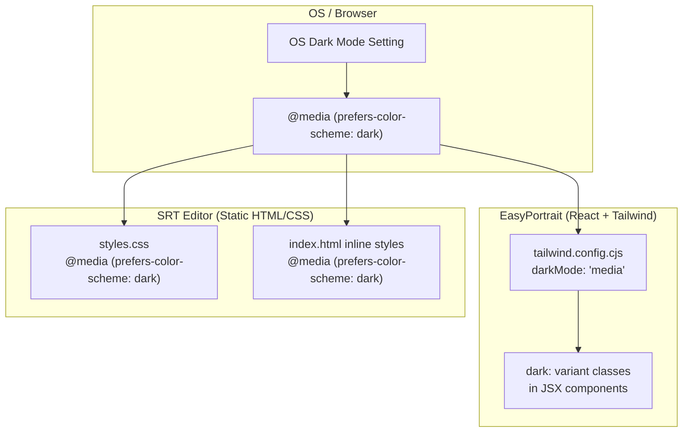

# Design Document: Dark Mode

## Overview

This design adds automatic dark mode support to the WithSwag platform, covering the EasyPortrait React app and the SRT Editor static app. Dark mode is purely CSS-driven via the `prefers-color-scheme` media query — no JavaScript theme logic, no manual toggle, no localStorage persistence. The user's OS setting is the single source of truth, and changes apply in real-time because CSS media queries are live.

### Key Design Decisions

1. **No toggle, no JS theme logic**: The CSS `prefers-color-scheme: dark` media query handles everything. This eliminates an entire class of state management bugs and keeps the implementation minimal.
2. **Tailwind `media` strategy for EasyPortrait**: Tailwind's `darkMode: 'media'` maps `dark:` variants directly to `@media (prefers-color-scheme: dark)`. No class toggling needed.
3. **CSS-only for SRT Editor**: A single `@media (prefers-color-scheme: dark)` block in `styles.css` overrides light-mode colors. Inline navigation styles in `index.html` get a matching media query block.
4. **Shared dark palette**: Both apps use the same slate-based dark palette for visual consistency across the platform.

### Dark Palette

| Token | Light Value | Dark Value | Tailwind Class |
|-------|------------|------------|----------------|
| Body background | `#eff6ff → #f5f3ff` gradient | `#0f172a` solid | `dark:bg-slate-900` |
| Surface/cards | `#ffffff` | `#1e293b` | `dark:bg-slate-800` |
| Primary text | `#111827` / `#1a1a1a` | `#f1f5f9` | `dark:text-slate-100` |
| Secondary text | `#6b7280` / `#666` | `#94a3b8` | `dark:text-slate-400` |
| Borders | `#e5e7eb` / `#e0e0e0` | `#334155` | `dark:border-slate-700` |
| Primary accent | `#6366f1` | `#6366f1` (unchanged) | — |
| Nav background | `rgba(255,255,255,0.8)` | `rgba(15,23,42,0.8)` | `dark:bg-slate-900/80` |

## Architecture



The architecture is intentionally flat. There is no theme context, no provider, no event listeners. The browser's CSS engine evaluates the media query and applies the matching styles. When the OS setting changes, the browser re-evaluates immediately — no JavaScript involved.

## Components and Interfaces

### EasyPortrait Components Requiring Dark Mode Updates

Each component needs `dark:` Tailwind classes added to its existing className strings:

| Component | File | Key Changes |
|-----------|------|-------------|
| LandingPage | `src/pages/LandingPage.tsx` | Body gradient → `dark:bg-slate-900`, nav → `dark:bg-slate-900/80 dark:border-slate-700`, cards → `dark:bg-slate-800`, text → `dark:text-slate-100` / `dark:text-slate-400` |
| EditorPage | `src/pages/EditorPage.tsx` | Body → `dark:bg-slate-900`, header → `dark:bg-slate-800 dark:border-slate-700`, step pills → `dark:bg-slate-700` / active unchanged, sidebar cards → `dark:bg-slate-800 dark:border-slate-700` |
| AppSwitcher | `src/components/AppSwitcher.tsx` | Button → `dark:bg-slate-800/90 dark:text-slate-300`, dropdown → `dark:bg-slate-800 dark:border-slate-700`, items hover → `dark:hover:bg-indigo-900/50`, mobile sheet → `dark:bg-slate-800` |
| Breadcrumbs | `src/components/Breadcrumbs.tsx` | Links → `dark:text-slate-400 dark:hover:text-indigo-400`, current → `dark:text-slate-100`, separator → `dark:text-slate-600` |
| AdjustmentPanel | `src/components/AdjustmentPanel.tsx` | Panel bg → `dark:bg-slate-800 dark:border-slate-700`, labels → `dark:text-slate-300`, slider track → `dark:bg-slate-600`, preview container → `dark:bg-slate-800 dark:border-slate-700` |
| ImageUpload | `src/components/ImageUpload.tsx` | Drop zone → `dark:bg-slate-800 dark:border-slate-600`, text → `dark:text-slate-300` |
| PhotoPreview | `src/components/PhotoPreview.tsx` | Container → `dark:bg-slate-800 dark:border-slate-700` |
| PassportSizeSelect | `src/components/PassportSizeSelect.tsx` | List container → `dark:bg-slate-800 dark:border-slate-700`, items → `dark:text-slate-300 dark:hover:bg-slate-700` |
| EditorControls | `src/components/EditorControls.tsx` | Controls container → `dark:bg-slate-800 dark:border-slate-700`, inputs → `dark:bg-slate-700 dark:border-slate-600 dark:text-slate-100` |
| PaymentModal | `src/components/PaymentModal.tsx` | Modal content → `dark:bg-slate-800`, text → `dark:text-slate-100`, price cards → `dark:border-slate-600` |

### Tailwind Configuration Change

```javascript
// tailwind.config.cjs
module.exports = {
  darkMode: 'media', // <-- ADD THIS LINE
  content: ['./index.html', './src/**/*.{js,ts,jsx,tsx}'],
  // ... rest unchanged
};
```

### SRT Editor CSS Changes

A single `@media (prefers-color-scheme: dark)` block appended to `srt-editor/styles.css` overriding:
- `body` background
- `header` background, border, text colors
- `.import-area`, `.tool-card`, `.subtitle-item`, `.manual-form`, `.seo-content`, `.ad-container` backgrounds and borders
- All text inputs, textareas, selects
- `.modal-content`, `.price-card`, `.edit-dialog`, `.confirm-dialog` backgrounds
- `.mode-btn` colors and active states
- Navigation inline styles in `index.html` (AppSwitcher, Breadcrumbs)

### SRT Editor Inline Navigation Styles

The `<style>` block in `srt-editor/index.html` contains navigation component styles (`.ws-app-switcher-btn`, `.ws-app-switcher-dropdown`, `.ws-breadcrumbs`, etc.). A `@media (prefers-color-scheme: dark)` block will be added inside that same `<style>` tag to override navigation colors.

## Data Models

No new data models are introduced. Dark mode is purely a presentation-layer concern with no state, no storage, and no API changes. The dark palette values are expressed as:

- **Tailwind utility classes** in EasyPortrait (compiled at build time)
- **CSS custom properties or direct color values** in SRT Editor's `@media` block

No theme object, no context provider, no runtime configuration is needed.


## Correctness Properties

*A property is a characteristic or behavior that should hold true across all valid executions of a system — essentially, a formal statement about what the system should do. Properties serve as the bridge between human-readable specifications and machine-verifiable correctness guarantees.*

### Property 1: EasyPortrait dark palette application

*For any* EasyPortrait UI element that has a dark-mode Tailwind override (body, cards, text, borders, nav bar, inputs), when `prefers-color-scheme` is `dark`, the computed style (background-color, color, or border-color) should match the corresponding dark palette token (slate-900 for body, slate-800 for surfaces, slate-100 for primary text, slate-400 for secondary text, slate-700 for borders).

**Validates: Requirements 1.1, 2.1, 2.2, 2.3, 2.4, 2.5, 2.7**

### Property 2: SRT Editor dark palette application

*For any* SRT Editor UI element that has a dark-mode CSS override (body, header, cards, panels, inputs, textareas, selects, modals, text), when `prefers-color-scheme` is `dark`, the computed style should match the corresponding dark palette token (#0f172a for body, #1e293b for surfaces, #f1f5f9 for primary text, #94a3b8 for secondary text, #334155 for borders).

**Validates: Requirements 1.2, 3.1, 3.2, 3.3, 3.4, 3.5, 3.7**

### Property 3: Primary accent color invariance

*For any* element in either app that uses the indigo primary accent color (`#6366f1`), the color value should remain `#6366f1` in both light and dark modes. The accent color must not change when the system preference switches.

**Validates: Requirements 2.6, 3.6**

### Property 4: WCAG contrast ratio compliance

*For any* text/background color pair in the dark palette, the WCAG 2.1 contrast ratio between the foreground color and its background color must be at least 4.5:1 for normal text and at least 3:1 for large text and interactive UI components. Specifically: slate-100 on slate-900 (~15.4:1), slate-100 on slate-800 (~11.9:1), slate-400 on slate-900 (~4.6:1), slate-400 on slate-800 (~3.6:1), and indigo-500 on slate-800 (~4.5:1) must all meet their respective thresholds.

**Validates: Requirements 5.1, 5.2, 5.3**

## Error Handling

Dark mode is a pure CSS feature with no runtime logic, so error scenarios are minimal:

| Scenario | Handling |
|----------|----------|
| Browser doesn't support `prefers-color-scheme` | Light mode remains the default. No dark styles are applied. The app works exactly as it does today. |
| Tailwind `dark:` classes not compiled | Build-time issue. The Tailwind config must include `darkMode: 'media'`. If missing, `dark:` classes are ignored and light mode persists. Caught during development/build. |
| SRT Editor CSS media query malformed | Dark styles don't apply; light mode persists. No runtime error. Caught during development via visual inspection. |
| Missing dark override on an element | Element renders with its light-mode color on a dark background, creating a visual inconsistency. Caught during visual QA. No crash or functional impact. |
| Inline styles override dark classes | Tailwind `dark:` utilities have lower specificity than inline `style` attributes. Any element with hardcoded inline colors won't respond to dark mode. Must be audited during implementation. |

No try/catch blocks, error boundaries, or fallback logic are needed. The worst case is always "light mode persists," which is the current production behavior.

## Testing Strategy

### Dual Testing Approach

Both unit tests and property-based tests are used:

- **Unit tests**: Verify specific examples (e.g., "the body background is #0f172a in dark mode"), edge cases (e.g., "an element with no dark override keeps its light color"), and structural checks (e.g., "tailwind.config.cjs contains darkMode: 'media'").
- **Property tests**: Verify universal properties across all themed elements using generated inputs.

### Property-Based Testing

**Library**: `fast-check` (JavaScript/TypeScript property-based testing library, works with Vitest/Jest)

**Configuration**:
- Minimum 100 iterations per property test
- Each test tagged with a comment referencing the design property

**Tag format**: `Feature: dark-mode, Property {number}: {property_text}`

Each correctness property maps to a single property-based test:

| Property | Test Approach |
|----------|--------------|
| P1: EasyPortrait dark palette | Generate random selections from the set of all EasyPortrait themed elements. For each, assert computed dark-mode style matches the expected dark palette token. Uses `fast-check` `fc.constantFrom(...)` to pick elements from the themed element registry. |
| P2: SRT Editor dark palette | Same approach for SRT Editor elements. Generate random selections from all SRT Editor themed elements and verify computed styles under the dark media query. |
| P3: Accent color invariance | Generate random selections from all elements using the indigo accent. Assert the color value is identical in both light and dark modes. |
| P4: Contrast ratio compliance | Generate random pairs from the dark palette color mapping (text color, background color). Compute WCAG contrast ratio and assert it meets the threshold (4.5:1 for normal text, 3:1 for large text/UI). |

### Unit Tests

- Verify `tailwind.config.cjs` has `darkMode: 'media'` (Requirement 1.4)
- Verify `srt-editor/styles.css` contains `@media (prefers-color-scheme: dark)` block (Requirement 1.5)
- Verify specific element computed styles in dark mode (body, nav, cards) as smoke tests
- Verify navigation components (AppSwitcher, Breadcrumbs) have dark overrides (Requirements 4.1–4.5)
- Verify no element has a contrast ratio below 3:1 in the dark palette (edge case for secondary text on surfaces)

### Testing Tools

- **Vitest** + **fast-check** for EasyPortrait property tests
- **jsdom** or **happy-dom** for simulating `prefers-color-scheme` media query in tests
- Manual visual QA in Chrome DevTools (Rendering > Emulate CSS media feature `prefers-color-scheme: dark`) for both apps
